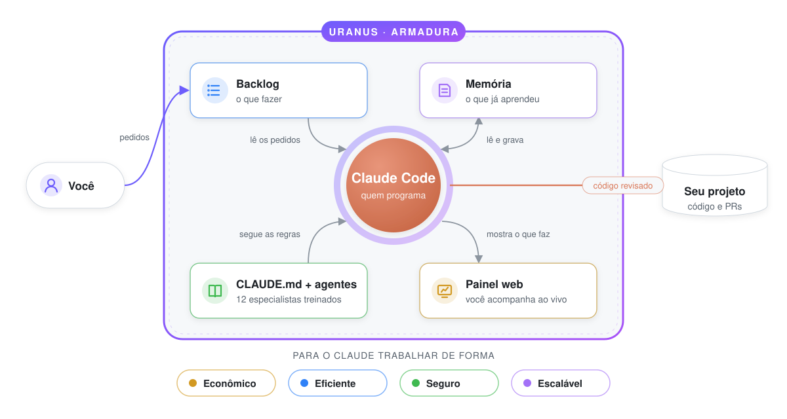

# Uranus

**Uma armadura para o Claude Code.**

O [Claude Code](https://claude.com/claude-code) programa muito bem, mas cada sessão começa do zero,
ele tende a usar o modelo mais caro para tudo, e você não vê direito o que ele está fazendo. O
Uranus é o que ele veste para trabalhar no seu projeto de forma **econômica**, **eficiente**,
**segura** e **escalável**.

Quem programa continua sendo o Claude. O Uranus treina, organiza, protege e mostra.

> **Nunca usou?** Comece pelo [Guia do Uranus](docs/guia/README.md) — páginas curtas, em ordem,
> pensadas para quem está chegando agora.

---

## Em 30 segundos

<p align="center">
  <picture>
    <source media="(prefers-color-scheme: dark)" srcset="docs/assets/uranus-armadura-dark.svg">
    
  </picture>
</p>

| Peça           | O que faz por você                                                             | Saiba mais                                                   |
| -------------- | ------------------------------------------------------------------------------ | ------------------------------------------------------------ |
| 🧠 **Memória** | O Claude grava decisões, convenções e bugs; a próxima sessão já começa sabendo | [Memória e backlog](docs/guia/05-memoria-e-backlog.md)       |
| 📋 **Backlog** | Uma fila de pedidos em texto livre, com progresso e subtasks                   | [Memória e backlog](docs/guia/05-memoria-e-backlog.md)       |
| 🎓 **Treino**  | Gera o `CLAUDE.md` e 12 agentes especialistas para o seu projeto               | [Como treina o Claude](docs/guia/03-como-treina-o-claude.md) |
| 📺 **Painel**  | Backlog, memória, git e o Claude trabalhando ao vivo no navegador              | [O painel web](docs/guia/06-painel.md)                       |

---

## Os quatro pilares

|     | Pilar         | Como o Uranus garante                                                                                                                                                                                       |
| --- | ------------- | ----------------------------------------------------------------------------------------------------------------------------------------------------------------------------------------------------------- |
| 💰  | **Econômico** | Cada agente tem o modelo do tamanho certo (`haiku` para tarefa mecânica, `opus` só para raciocínio difícil); um agente barato explora o código antes dos caros; memória evita redescobrir o que já se sabe. |
| ⚡  | **Eficiente** | Planeja antes de fazer, quebra em subtasks e roda em paralelo o que não conflita; revisão no fim de cada subtask pega erro cedo.                                                                            |
| 🛡️  | **Seguro**    | Nunca apaga o que é seu; tudo local em arquivos legíveis; revisão de segurança obrigatória em código sensível; painel fechado por padrão; plugins com permissão mínima.                                     |
| 📈  | **Escalável** | Instruções por pasta para monorepos; memória com escopos e compactação; plugins por stack; projetos vizinhos que trocam pedidos entre si.                                                                   |

Detalhes de cada mecanismo: [Os quatro pilares](docs/guia/04-os-quatro-pilares.md).

---

## Começo rápido

Precisa de Node 22+, pnpm, git e o Claude Code com login feito.

```bash
# 1. instalar (uma vez)
git clone https://github.com/ruyteer/uranus.git && cd uranus
pnpm install && pnpm build
cd packages/cli && npm link

# 2. ligar no seu projeto
cd ~/meu-projeto
uranus init

# 3. pedir algo
uranus backlog add "Exportar relatório em CSV" --body "Hoje só exporta PDF."

# 4. colocar o Claude para trabalhar
uranus chat            # e peça: "olhe o backlog e trabalhe no item de CSV"

# 5. acompanhar (em outro terminal)
uranus dashboard       # http://localhost:4319
```

Passo a passo explicado: [Primeiros passos](docs/guia/02-primeiros-passos.md).

---

## Documentação

### Para usar

1. [O que é o Uranus](docs/guia/01-o-que-e.md) — a ideia, em linguagem simples
2. [Primeiros passos](docs/guia/02-primeiros-passos.md) — instalar e fazer o primeiro pedido
3. [Como o Uranus treina o Claude](docs/guia/03-como-treina-o-claude.md) — `CLAUDE.md`, agentes, ciclo de aprendizado
4. [Os quatro pilares](docs/guia/04-os-quatro-pilares.md) — econômico, eficiente, seguro, escalável
5. [Memória, backlog e vault](docs/guia/05-memoria-e-backlog.md) — o uso do dia a dia
6. [O painel web](docs/guia/06-painel.md) — cada aba explicada
7. [Referência de comandos](docs/guia/07-comandos.md) — todos os comandos
8. [Configuração e plugins](docs/guia/08-configuracao-e-plugins.md) — ajustes e extensões
9. [Problemas comuns](docs/guia/09-problemas-comuns.md) — quando algo não funciona

- [Glossário](docs/guia/glossario.md) — palavras que podem ser novas

### Para entender por dentro

- [Arquitetura](docs/00-ARCHITECTURE.md) — tese, invariantes, decisões (ADRs) e modelo de domínio
- [Contratos](docs/01-CONTRACTS.md) — tipos e interfaces entre os módulos
- [Roadmap](docs/02-ROADMAP.md) — fases do projeto
- [Árvore do projeto](docs/03-TREE.md) — onde fica cada coisa
- [Riscos](docs/04-RISKS.md) — o que pode dar errado e como é mitigado

---

## Desenvolvendo o Uranus

```bash
pnpm install
pnpm check      # lint, tipos e testes
pnpm coverage
```

O Uranus é um monorepo TypeScript. Cada pacote tem uma responsabilidade só:

| Pacote              | Responsabilidade                                                       |
| ------------------- | ---------------------------------------------------------------------- |
| `@uranus/cli`       | O comando `uranus` e a geração do `CLAUDE.md`/agentes                  |
| `@uranus/dashboard` | Servidor do painel web, com eventos em tempo real                      |
| `@uranus/memory`    | Memória em Markdown                                                    |
| `@uranus/backlog`   | Backlog e o vínculo entre projetos vizinhos                            |
| `@uranus/context`   | Análise automática do projeto (stack, testes, CI)                      |
| `@uranus/plugins`   | Carregador de plugins, SDK e os plugins node, nextjs e docker          |
| `@uranus/agents`    | Catálogo de agentes e o motor que os executa                           |
| `@uranus/providers` | Integração com o Claude Code (e outros modelos, como suporte avançado) |
| `@uranus/config`    | Configuração em camadas, com validação                                 |
| `@uranus/events`    | Log de eventos persistente                                             |
| `@uranus/state`     | Banco de dados do estado do projeto                                    |
| `@uranus/core`      | Tipos, contratos e domínio compartilhados                              |
| `@uranus/kernel`    | O motor do modo automático (avançado)                                  |

A metodologia é Domain-Driven Design — veja o [`CLAUDE.md`](CLAUDE.md) e a
[arquitetura](docs/00-ARCHITECTURE.md).

---

## Licença

Apache 2.0
