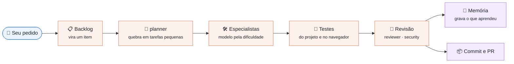

# Uranus

**Uma armadura para o Claude Code.**

O Uranus prepara o seu projeto para o [Claude Code](https://claude.com/claude-code) trabalhar nele
do jeito certo: gastando menos, sem perder o que já aprendeu, sem colocar o projeto em risco, e
dando conta de projetos grandes. Quem programa continua sendo o Claude — o Uranus é o que ele veste.

<p align="center">
  <picture>
    <source media="(prefers-color-scheme: dark)" srcset="docs/assets/uranus-armadura-dark.svg">
    
  </picture>
</p>

## O que ele faz

- **Treina o Claude para o seu projeto.** Gera o `CLAUDE.md`, 12 agentes especialistas e skills
  com conhecimento pronto. O Claude já abre sabendo a stack, as regras e como se organizar.
- **Dá memória.** O que o Claude aprende (decisões, convenções, bugs) fica salvo e volta na
  próxima sessão.
- **Organiza os pedidos** num backlog, em texto livre.
- **Economiza.** Cada tarefa vai para o modelo do tamanho certo: o barato para o trabalho mecânico,
  o caro só para o que exige raciocínio.

## Instalar

Precisa de [Node 22+](https://nodejs.org), [pnpm](https://pnpm.io), git e o
[Claude Code](https://claude.com/claude-code) com login feito.

```bash
git clone https://github.com/ruyteer/uranus.git
cd uranus
pnpm install && pnpm build
cd packages/cli && npm link     # deixa o comando `uranus` disponível em qualquer pasta
```

## Usar

Dentro do seu projeto, um comando só:

```bash
uranus init
```

Pronto. Isso monta toda a janela de contexto do projeto. A partir daí, abra o Claude Code como
sempre (`claude`) e só peça o que você quer: ele já está treinado para trabalhar ali.

> `uranus chat` faz o mesmo que `claude`, mas atualiza o contexto antes de abrir — útil depois de
> adicionar memória ou instruções.

## Como funciona



1. **Um pedido vira um item no backlog.** Você pode digitar `uranus backlog add "..."` ou só pedir
   na conversa.
2. **O `planner` quebra o item em tarefas pequenas** e decide quem faz cada uma e o que pode rodar
   em paralelo.
3. **Cada tarefa vai para um especialista** (backend, frontend, banco, bugs, docs…) **no modelo
   certo para a dificuldade**: `haiku` para o mecânico, `sonnet` para o dia a dia, `opus` para
   planejar e caçar bug difícil.
4. **É testada** com os testes do próprio projeto — e, se mexe em interface, abrindo no navegador.
5. **É revisada** pelo `reviewer` (e pelo `security`, se tocar autenticação ou dados).
6. **Vira commit e Pull Request**, e o que foi aprendido vai para a **memória** — a próxima tarefa
   começa sabendo mais.

## Conhecimento embarcado

Além de programar, o Uranus ensina o Claude a fazer trabalhos especializados. Não tem comando novo:
é só pedir.

### 🎬 Vídeo e motion

O Claude edita e produz vídeo **usando as fontes, cores, logo, componentes e telas do seu próprio
projeto**: anúncio e Reels/TikTok/Shorts, vídeo de vendas para YouTube, motion do seu SaaS,
tutorial com a tela real, e edição de vídeo gravado (você falando para a câmera) com legenda,
efeitos sonoros e cortes.

Exemplos do que pedir:

> Faz um Reels de 25 segundos apresentando o nosso painel, com narração.

> Edita este vídeo em que eu falo sobre o produto: corta os erros, coloca legenda e animações
> ilustrando o que eu digo. O arquivo está em `~/videos/gravacao.mp4`.

> Faz um tutorial para o YouTube mostrando como criar uma conta na plataforma.

O Claude mostra roteiro e storyboard para você aprovar antes de produzir. Veja o que é preciso
(ElevenLabs para a voz, ffmpeg) em [Vídeo e motion](docs/guia/10-video-e-motion.md).

## Painel web (opcional)

Se quiser acompanhar pelo navegador — backlog, memória, git e o Claude trabalhando ao vivo:

```bash
uranus dashboard     # abre em http://localhost:4319
```

Não é obrigatório: tudo funciona só com `uranus init` e o Claude Code.

## Quer saber mais?

O [Guia do Uranus](docs/guia/README.md) explica tudo em páginas curtas:
[o que é](docs/guia/01-o-que-e.md) ·
[primeiros passos](docs/guia/02-primeiros-passos.md) ·
[como ele treina o Claude](docs/guia/03-como-treina-o-claude.md) ·
[os quatro pilares](docs/guia/04-os-quatro-pilares.md) ·
[memória e backlog](docs/guia/05-memoria-e-backlog.md) ·
[painel](docs/guia/06-painel.md) ·
[comandos](docs/guia/07-comandos.md) ·
[configuração](docs/guia/08-configuracao-e-plugins.md) ·
[vídeo e motion](docs/guia/10-video-e-motion.md) ·
[problemas comuns](docs/guia/09-problemas-comuns.md)

Para quem quer contribuir: [arquitetura](docs/00-ARCHITECTURE.md) · `pnpm check` roda lint, tipos
e testes.

## Licença

Apache 2.0
