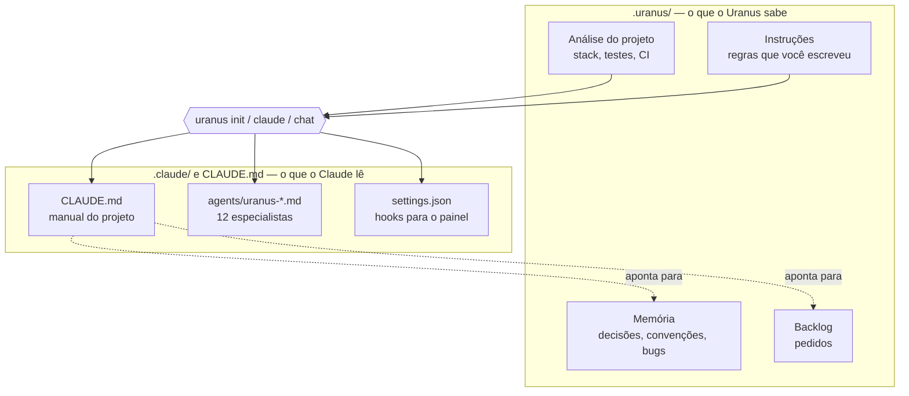
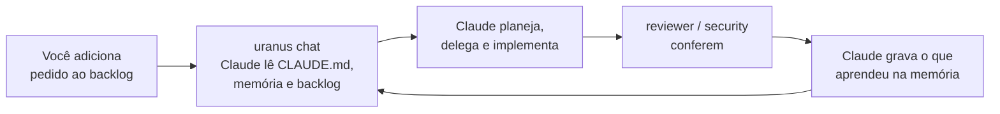

# 3. Como o Uranus treina o Claude

← [Primeiros passos](02-primeiros-passos.md) · Próximo: [Os quatro pilares](04-os-quatro-pilares.md) →

O Claude Code, ao abrir uma sessão numa pasta, lê sozinho alguns arquivos: o `CLAUDE.md` (as
instruções do projeto), `.claude/agents/` (os especialistas que ele pode chamar) e
`.claude/settings.json` (hooks e permissões). **O Uranus escreve esses arquivos por você**, e os
mantém atualizados a cada `uranus init`, `uranus claude` e `uranus chat`.

É isso que chamamos de treinar: o Claude chega no projeto já sabendo como trabalhar ali.

## O que vai no `CLAUDE.md`

A parte que o Uranus gera fica entre marcadores (`<!-- URANUS:BEGIN -->` … `<!-- URANUS:END -->`).
**Tudo que você escrever fora deles nunca é tocado.** Dentro, o Claude recebe:

| Seção                 | O que ensina                                                                  |
| --------------------- | ----------------------------------------------------------------------------- |
| Visão do projeto      | Linguagens, frameworks e comando de teste detectados automaticamente          |
| Backlog               | Onde estão os pedidos e como marcar um item como feito/descartado             |
| Memória               | Ler `.uranus/memory/` antes de assumir um padrão, e gravar o que aprender     |
| Catálogo de agentes   | Quem são os especialistas e quando chamar cada um                             |
| Regras de despacho    | Paralelizar, usar o modelo mais barato que resolve, revisar antes de entregar |
| Skills                | Conferir se falta uma skill antes de tarefas fora do comum                    |
| Teste no navegador    | Validar interfaces web abrindo de verdade, não só relendo o código            |
| Instruções do projeto | As regras que você cadastrou (pelo painel ou em `.uranus/instructions/`)      |

Instruções com escopo de pasta viram um `CLAUDE.md` dentro daquela pasta — útil em monorepos,
porque o Claude Code lê o `CLAUDE.md` mais próximo de onde está mexendo.

## Os agentes especialistas

Em vez de uma única sessão fazendo tudo com o modelo mais caro, o Claude vira um **orquestrador**
que delega para especialistas. Cada um tem uma função e um "tamanho" de modelo escolhido a dedo:

| Agente          | Modelo | Função                                                   |
| --------------- | ------ | -------------------------------------------------------- |
| `planner`       | opus   | Quebra um pedido em subtasks e decide quem faz o quê     |
| `context-scout` | haiku  | Explora uma área do código e devolve um resumo curto     |
| `backend`       | sonnet | Implementação de servidor, APIs, regras de negócio       |
| `frontend`      | sonnet | Interface, componentes, estilos                          |
| `database`      | sonnet | Schema, migrations, queries                              |
| `refactor`      | sonnet | Melhorar código sem mudar o comportamento                |
| `bug-hunter`    | opus   | Investigar falhas difíceis até a causa raiz              |
| `reviewer`      | sonnet | Revisar o que foi feito antes de dar como pronto         |
| `security`      | sonnet | Revisar autenticação, dados sensíveis, entradas externas |
| `docs`          | haiku  | Documentação                                             |
| `deps`          | haiku  | Dependências                                             |
| `git-release`   | haiku  | Commits, branches, releases                              |

> **Por que três modelos?** `opus` é o mais capaz e o mais caro; `haiku` é rápido e barato.
> Raciocínio difícil (planejar, caçar bug) vai para `opus`; trabalho mecânico (explorar, documentar,
> mexer em git) vai para `haiku`; o dia a dia fica com `sonnet`. Veja o impacto disso em
> [Os quatro pilares](04-os-quatro-pilares.md#-econômico).

Os arquivos ficam em `.claude/agents/uranus-*.md`. Um agente que você escrever à mão com outro nome
nunca é sobrescrito.

## O ciclo de aprendizado

O treino não é uma vez só. Ele melhora a cada sessão:

A primeira sessão num projeto novo já é melhor que o `claude` puro (o Claude sabe a stack e como
se organizar). A décima é muito melhor, porque a memória acumulou as decisões, preferências e
armadilhas daquele projeto.

## Hooks: o Claude avisando o que está fazendo

O Uranus registra quatro hooks no `.claude/settings.json` (`UserPromptSubmit`, `Stop`,
`SubagentStart`, `SubagentStop`). Eles só enviam um aviso para o painel quando uma etapa começa ou
termina — é isso que alimenta a visualização ao vivo. Hooks que você já tinha são preservados.

---

← [Primeiros passos](02-primeiros-passos.md) · Próximo: [Os quatro pilares](04-os-quatro-pilares.md) →
