# 10. Vídeo e motion

← [Problemas comuns](09-problemas-comuns.md) · [Índice do guia](README.md)

O Uranus ensina o Claude Code a **produzir e editar vídeo** dentro do seu projeto. Não existe
comando novo: depois do `uranus init`, é só pedir.

## O que dá para pedir

| Tipo                              | Exemplo de pedido                                                                                  |
| --------------------------------- | -------------------------------------------------------------------------------------------------- |
| Anúncio / Reels / TikTok / Shorts | "Faz um Reels de 25 s apresentando o nosso painel, com narração."                                  |
| Vídeo de vendas para YouTube      | "Faz um vídeo de vendas de 30 s em 16:9 e a mesma versão em 9:16."                                 |
| Motion do seu SaaS                | "Cria uma animação mostrando como o fluxo de checkout funciona."                                   |
| Tutorial com a tela real          | "Faz um tutorial para o YouTube mostrando como criar uma conta."                                   |
| Edição de vídeo gravado           | "Edita `~/videos/gravacao.mp4`: corta os erros, põe legenda e animações ilustrando o que eu falo." |

## Feito com os materiais do _seu_ projeto

O Claude não inventa um visual. Antes de criar qualquer cena, ele levanta o que o projeto já tem:

- cores e tokens de design (CSS, Tailwind, tema);
- fontes, logo e símbolo;
- a biblioteca de ícones e os componentes do app;
- a copy da landing;
- prints reais das telas, com dados de demonstração.

A interface que aparece no vídeo é uma reconstrução fiel das telas reais — nunca um redesenho.

## Como o trabalho acontece

```mermaid
flowchart LR
    A(["💬 Pedido"]) --> B["📝 Roteiro<br/><small>você aprova</small>"]
    B --> C["🎞️ Storyboard<br/><small>você aprova</small>"]
    C --> D["🎙️ Narração<br/><small>ElevenLabs</small>"]
    D --> E["🎨 Cenas<br/><small>HTML + GSAP</small>"]
    E --> F["🔍 Prévia<br/><small>quadros-chave</small>"]
    F --> G["🎬 Render + mix"]
    G --> H["✅ Checagem final<br/><small>áudio, legibilidade</small>"]
    H --> I(["📦 MP4"])

    classDef voce fill:#eef4ff,stroke:#2f81f7,color:#1f2328
    classDef claude fill:#fdf1ec,stroke:#d97757,color:#1f2328
    class A,B,C,I voce
    class D,E,F,G,H claude
```

1. **Roteiro e storyboard primeiro.** O Claude mostra e espera o seu "ok" antes de gerar voz ou
   código.
2. **Narração natural** com ElevenLabs, numa tomada só, depois compactada para o ritmo de Reels.
3. **Cenas** montadas em [HyperFrames](https://www.npmjs.com/package/hyperframes) (HTML + GSAP,
   render determinístico). Em vídeos com muitas cenas, subagentes montam várias em paralelo.
4. **Prévia** dos quadros-chave antes do render completo, para corrigir cedo.
5. **Render, mixagem e checagem**: volume no padrão das redes (−14 LUFS), efeitos sonoros
   audíveis, nenhum quadro vazio, texto legível no celular.
6. **Gosto registrado.** O que você aprovou e reprovou vai para a memória do projeto, e o próximo
   vídeo já começa daí.

## Regras que já vêm aprendidas

Tudo isso já foi testado em produções reais e está no playbook:

- gancho no primeiro segundo, um corte a cada 1–4 s, nada parado, encerramento curto;
- o protagonista é o produto real ou a pessoa — nada de arte abstrata genérica;
- legenda de ênfase em cena própria, ou bloco de até 3 palavras com fade — nunca palavra por palavra
  piscando;
- efeitos sonoros abaixo da voz, mas audíveis; sem música (você põe no app);
- anúncio pago com 20–30 s.

## O que você precisa ter

| O quê                                                                                                 | Para quê                                                                                                |
| ----------------------------------------------------------------------------------------------------- | ------------------------------------------------------------------------------------------------------- |
| [ffmpeg](https://ffmpeg.org)                                                                          | Corte, mixagem e conversão                                                                              |
| Conta paga na [ElevenLabs](https://elevenlabs.io) (Starter serve)                                     | Narração e efeitos sonoros. O plano gratuito não permite uso comercial nem vozes da biblioteca pela API |
| Node 22+                                                                                              | O HyperFrames roda em Node, num projeto separado que o Claude cria                                      |
| Python + [faster-whisper](https://github.com/SYSTRAN/faster-whisper) _(só para editar vídeo gravado)_ | Transcrição palavra por palavra                                                                         |

A chave da ElevenLabs **nunca** vai para o repositório: o Claude pede e guarda fora do git.

## Onde fica o conhecimento

O `uranus init` instala a skill em `.claude/skills/uranus-motion-video/`:

- `SKILL.md` — o resumo que o Claude Code carrega sozinho quando o pedido é de vídeo;
- `PLAYBOOK.md` — o manual completo: regras de ouro, gosto aprovado e reprovado, fluxo, parâmetros
  de voz, efeitos, ffmpeg, receitas de cena e problemas já resolvidos.

Ela é regenerada a cada `uranus init`, `uranus claude` e `uranus chat`. Para ajustar o gosto do
**seu** projeto, não edite esses arquivos: grave na memória (ex.:
`uranus memory add "Vídeos sem narração" --scope preference --body "..."`) ou crie uma instrução —
o Claude cruza as duas coisas.

---

← [Problemas comuns](09-problemas-comuns.md) · [Índice do guia](README.md)
